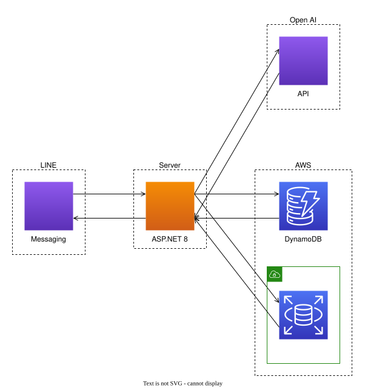

# nagiyu-line

## 概要

nagiyu-line は、LINE Messaging API・OpenAI API・AWS DynamoDB を活用した会話型AIチャットボットサービスです。

- LINE での会話を OpenAI (ChatGPT) で生成
- 会話履歴を DynamoDB に保存

---

## システム構成



- **LINE Messaging API**: Webhook イベントの受信・返信送信
- **OpenAI API**: AIによる会話生成
- **AWS DynamoDB**: トーク履歴の保存・取得

---

## 主な機能

- LINE 公式アカウントとのチャット
- OpenAI (ChatGPT) を用いた自然な会話生成
- 会話履歴の保存・リセット
- 1日あたりのトーク数制限
- 管理者による会話内容の確認（品質向上目的）
- 「リセット」コマンドによる会話履歴の初期化

---

## プロジェクト構成

```
/workspace
├── Line/                 # ASP.NET Core Webアプリ本体 (コントローラ・ビュー・設定)
├── LineBridge/           # LINE, OpenAI, DynamoDB 連携ロジック
├── OpenAI/               # OpenAI API クライアント
├── DynamoDBAccessor/     # DynamoDB アクセス層
├── Common/               # 共通ユーティリティ
├── docs/                 # ドキュメント・構成図
├── containers/           # Docker関連
├── nginx/                # Nginx関連
└── ...
```

---

## 開発・実行方法

### 1. 必要な環境
- .NET 8.0
- Docker (開発用)
- AWS アカウント (DynamoDB)
- OpenAI API キー

### 2. ローカル実行

```sh
cd Line
# 必要に応じて appsettings.json を編集
# 実行
dotnet run
```

### 3. Docker で起動

```sh
cd containers
cp .env.sample .env  # 必要に応じて
# 起動
docker-compose up --build
```

---

## 使い方・注意事項

- [使い方ガイド](Line/Views/Home/HowToUse.cshtml) も参照してください
- 利用規約・プライバシーポリシーへの同意が必要です
- 会話内容は品質向上のため管理者が確認する場合があります
- サービスは個人運営のため、予告なく変更・終了する場合があります

---

## ライセンス

このリポジトリは MIT ライセンスです。
